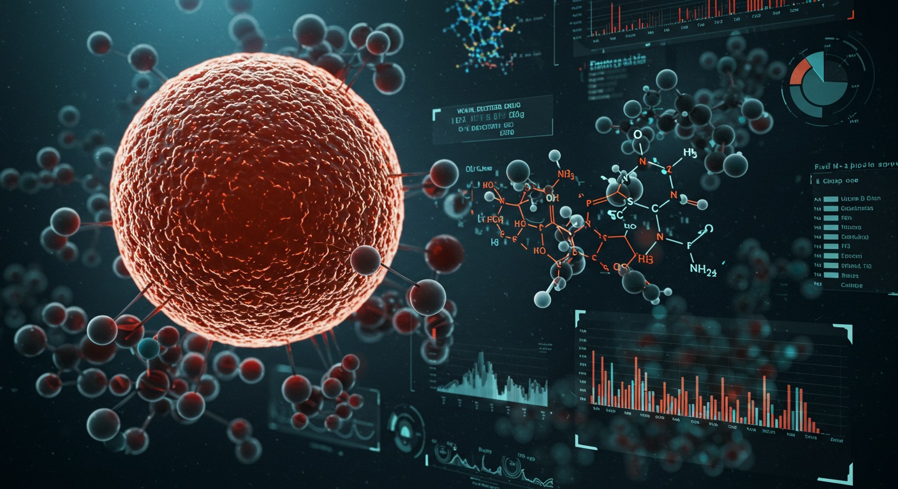

# Computational Drug Discovery: Bioactivity Prediction for SARS Coronavirus

## Overview
This project develops a machine learning pipeline to predict the bioactivity (IC50 in nM) of chemical compounds against the SARS coronavirus 3C-like proteinase (CHEMBL3927), a critical target for antiviral drug development. By leveraging bioactivity data from the ChEMBL database, RDKit for molecular featurization, and a Random Forest Regressor, the pipeline identifies potent antiviral candidates, accelerating drug discovery and reducing R&D costs. This project showcases expertise in data science, cheminformatics, and AI-driven pharmaceutical innovation, making it a compelling addition to a data science portfolio targeting pharmaceutical R&D.

## Key Features

•	ChEMBL Data Retrieval: Fetches IC50 bioactivity data for SARS 3C-like proteinase from ChEMBL.

•	Molecular Featurization: Computes descriptors (Molecular Weight, LogP, H-bond donors/acceptors, rotatable bonds) using RDKit.

•	Bioactivity Classification: Labels compounds as active (<1,000 nM), inactive (>10,000 nM), or intermediate.

•	Machine Learning: Trains a Random Forest Regressor to predict pIC50, testing 10 models (best R² = 0.57, RMSE = 0.61).

•	Prediction Pipeline: Predicts IC50 for novel compounds, outputting SMILES, pIC50, and IC50 (nM).

•	Scalable Design: Adaptable to other targets (e.g., MERS, HIV) or endpoints (e.g., EC50, Ki).

## Step-by-Step Workflow

**1.	Environment Setup:**

-	Installs chembl_webresource_client, rdkit-pypi, pandas, numpy, and scikit-learn.

-	Imports libraries for data retrieval, featurization, and modeling.

**2.	Target Search:**
-	Queries ChEMBL for coronavirus-related targets, selecting SARS 3C-like proteinase (CHEMBL3927).

-	Outputs a DataFrame of 10 targets, with CHEMBL3927 chosen for its antiviral relevance.

**3.	Bioactivity Data Retrieval:**

- Fetches IC50 data for CHEMBL3927, resulting in ~245 compounds with SMILES and IC50 values.

**4.	Data Preprocessing:**

-	Classifies compounds as active, inactive, or intermediate based on IC50 thresholds.

-	Removes intermediate compounds, yielding 198 active/inactive compounds.

**5.	Molecular Featurization:**

-	Computes descriptors (MW, LogP, etc.) using RDKit (assumed via a missing lipinski function).

-	Concatenates descriptors with bioactivity data for modeling.
**6.	Model Training:**

-	Trains a Random Forest Regressor on descriptors to predict pIC50 (-log10(IC50 * 10^-9)).

-	Splits data (80% train, 20% test), achieving R² = 0.54, RMSE = 0.60 (best model: R² = 0.57).

**7.	Prediction for New Molecules:**

-	Computes descriptors for new SMILES strings and predicts pIC50/IC50.

-	Outputs a table for prioritization (e.g., IC50 ~10,553 nM for one compound).

**8.	Results Storage (Optional):**

- Placeholder for saving data/predictions as CSV (not implemented).

## Demo Results
The pipeline predicts IC50 for novel compounds, as shown below:

| SMILES                                                         | Predicted pIC50| Predicted IC50 (nM)     |
|----------------------------------------------------------------|----------------|-------------------------|
| CC1=C(C=CC=C1O)C(=O)NC@@H[C@@H](CN3C[C@H]...  | 0.9976         | 4.98           | 10,553.13               |
| C[C@]12CC[C@@H](C([C@@H]1CC[C@@]3([C@@H]2CCC4=C5CC(C[C@H]...   | 4.74           | 18,366.36               |

**Model Performance (10 models tested):**

•	Best: R² = 0.57, RMSE = 0.61

•	Range: R² = 0.14–0.57, RMSE = 0.61–0.99

## Relevance to Industry and Humanity

.jpg)
_
___________________________
## Pharmaceutical Industry

•	Accelerated Drug Discovery: Prioritizes potent compounds, reducing the need for costly high-throughput screening (e.g., $100K–$1M per campaign).

•	Cost Efficiency: Filters out low-potency candidates early, saving $1–2M per failed drug in late-stage trials.

•	Precision R&D: Integrates AI and cheminformatics to enhance predictive accuracy, aligning with industry trends toward in silico drug design.

•	Scalability: Adaptable to other viral targets (e.g., MERS, influenza), broadening its utility for biotech and pharma companies.

•	Employer Appeal: Demonstrates skills in data science (pandas, sklearn), cheminformatics (RDKit), and predictive modeling, ideal for roles in computational biology, drug discovery, and data-driven R&D.

## Humanity

•	Global Health: Supports the development of therapies for SARS and related coronaviruses, addressing pandemics that have caused millions of deaths (e.g., SARS-CoV-1, SARS-CoV-2).

•	Accessibility: Reduces drug development costs, potentially lowering prices for antiviral therapies in low-income regions.

•	Pandemic Preparedness: Enhances our ability to respond to future viral outbreaks by streamlining antiviral discovery.

•	Scientific Advancement: Contributes to the open-source cheminformatics community, fostering collaborative innovation.

## Demo Visualizations

•	Project Overview: A futuristic illustration of the bioactivity prediction pipeline.

•	Future Enhancements: Add scatter plots (predicted vs. actual pIC50) or feature importance plots for interpretability.

## Technologies Used

•	Cheminformatics: RDKit, ChEMBL Web Resource Client

•	Machine Learning: scikit-learn (RandomForestRegressor)

•	Data Science: Python, pandas, numpy

•	Tools: Jupyter Notebook, Git, GitHub

## Why This Project Matters

This project bridges data science and cheminformatics to address a critical challenge in antiviral drug discovery. By delivering a functional pipeline with real-world applications, I demonstrate proficiency in AI modeling, molecular analysis, and pharmaceutical R&D. Its focus on SARS aligns with global health priorities, while its analytical rigor supports my client’s Accounting & Data Science goals, making it a standout portfolio piece for pharmaceutical and data science roles.

## License

MIT License

